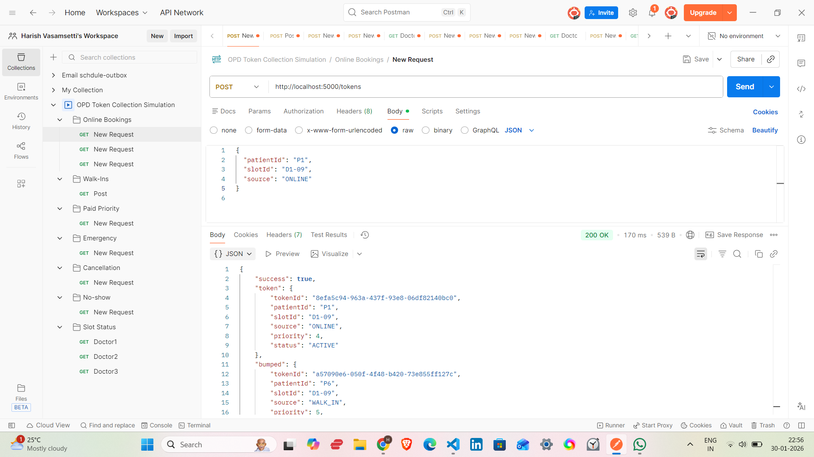
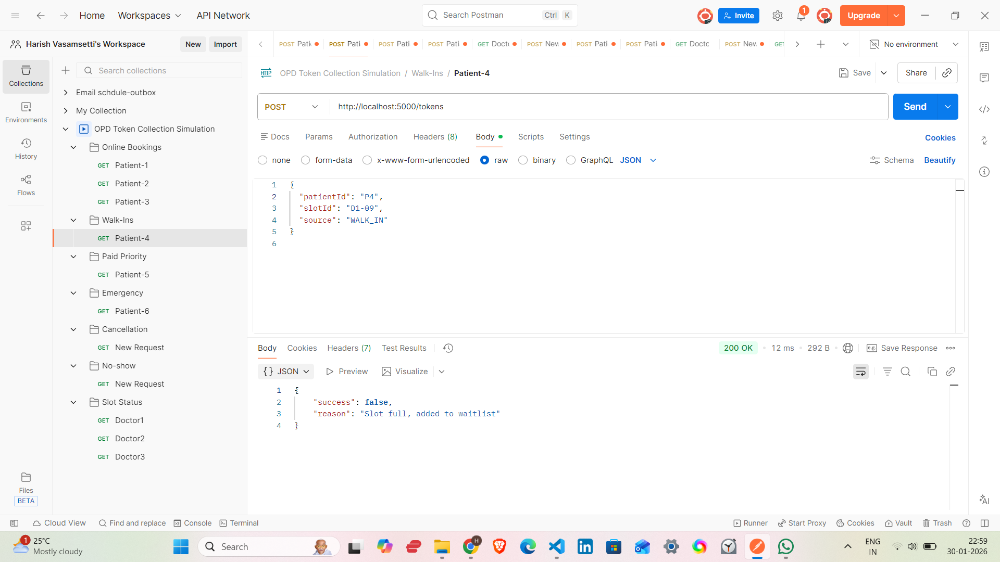
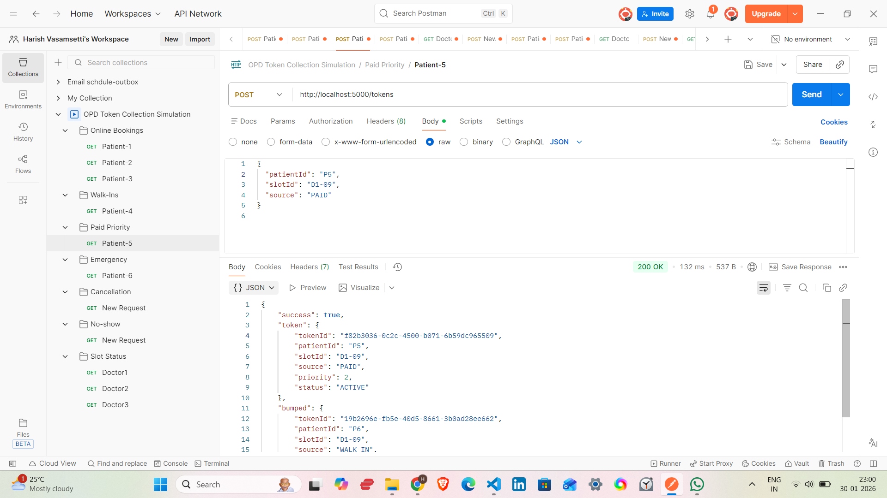
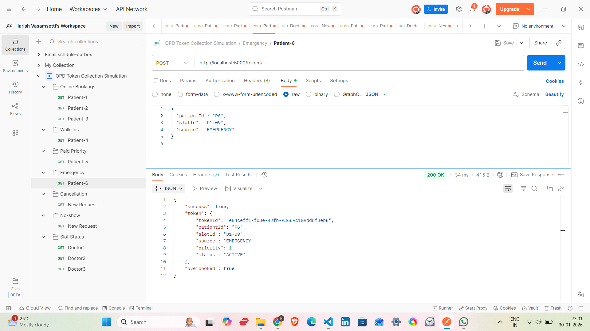
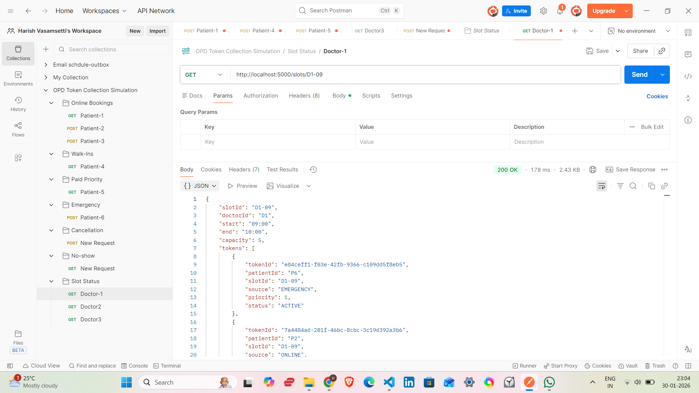
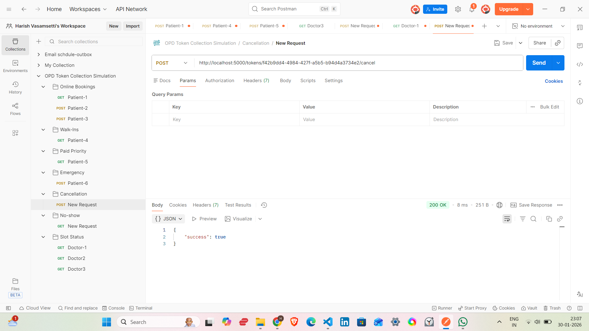
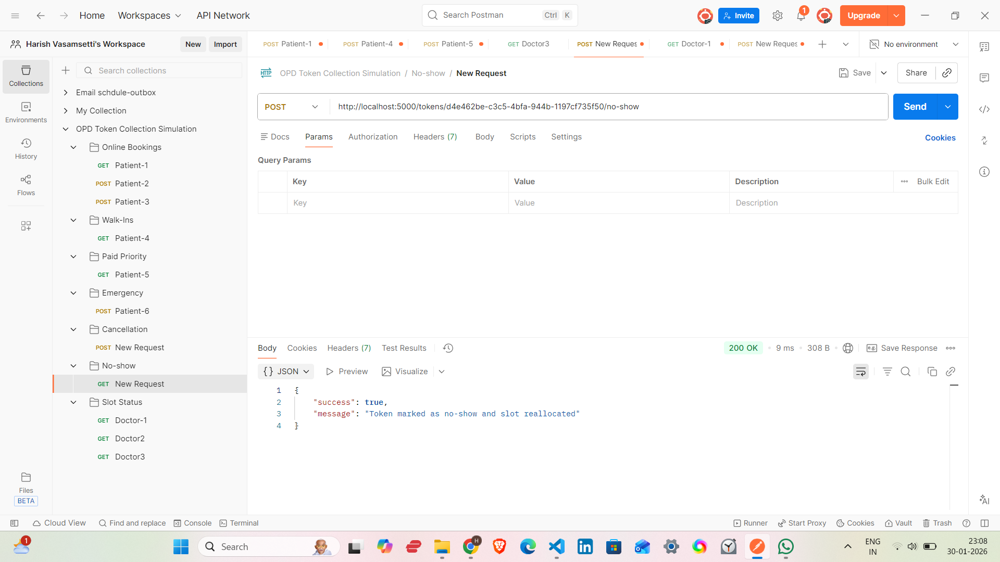

OPD Token Allocation Engine

Backend Intern Assignment

**Overview**

This project implements a backend service for allocating OPD tokens to doctors while handling real-world hospital scenarios such as capacity limits, prioritization, cancellations, no-shows, and emergency cases.
Doctors operate in fixed time slots (e.g., 09:00–10:00). Each slot has a hard capacity, and patients can request tokens from multiple sources like online booking, walk-ins, paid priority, follow-ups, and emergencies.
The system dynamically reallocates tokens when conditions change, ensuring fairness and operational efficiency.

**Key Features**

Per-slot hard capacity enforcement

Priority-based token allocation

Dynamic reallocation on cancellation and no-shows

Emergency handling with controlled overbooking

Fully API-driven backend

Realistic OPD day simulation using Postman

**Assumptions**

Each doctor has predefined time slots

Each slot has a fixed maximum capacity

Lower numeric priority value means higher importance

Emergency patients must always be accommodated

No-shows are detected manually via API (simulating time cutoff)

In-memory storage is used for simplicity

Token Sources & Priority Order
Source	Priority
EMERGENCY	1 (Highest)
PAID	2
FOLLOW_UP	3
ONLINE	4
WALK_IN	5 (Lowest)

**Rules:**

Higher priority tokens can bump lower priority ones
Lower priority tokens cannot displace higher priority ones
Emergency tokens bypass capacity limits and mark the slot as overbooked
Core Allocation Algorithm

When a token request is received:

Validate the requested slot

If slot capacity is available → assign token

If slot is full:

Emergency → allow overbooking

Higher priority → bump lowest-priority token

Otherwise → add to waitlist

On cancellation or no-show:

Free the slot

Promote highest-priority waitlisted token

This ensures fairness while maintaining operational constraints.

**API Design**
Create Token

POST /tokens

{
  "patientId": "P1",
  "slotId": "D1-09",
  "source": "ONLINE"
}

Cancel Token

POST /tokens/{tokenId}/cancel

Mark No-Show

POST /tokens/{tokenId}/no-show

Get Slot Status

GET /slots/{slotId}

## OPD Day Simulation (Postman Evidence)

### 1. Online Booking Fills Slot

### 2. Walk-in Added to Waitlist

### 3. Paid Patient Bumps Lower Priority

### 4. Emergency Overbooks Slot

### 5. Slot Status After Overbooking

### 6. Cancellation Triggers Reallocation

### 7. No-show Frees Slot

The system is tested by simulating a real OPD day entirely using Postman.

Example Timeline (Doctor D1: 09:00–10:00)

09:00 – Online bookings fill the slot

09:10 – Walk-in patient added to waitlist

09:20 – Paid patient bumps a lower priority booking

09:30 – Emergency patient overbooks the slot

09:40 – Cancellation triggers reallocation

09:45 – No-show frees capacity and promotes waitlisted patient

This approach closely mirrors real hospital workflows.

Edge Case Handling
Scenario	Handling
Slot full	Waitlist or priority bump
Cancellation	Auto reallocation
No-show	Slot freed + reallocation
Emergency	Overbooking allowed
Overload	Priority enforcement
Trade-offs & Future Improvements

In-memory storage is fast but non-persistent

No authentication (out of scope for assignment)

Time-based automation can be added using schedulers

Database and caching can be added for scale

Analytics for doctor load and wait times can be added

Conclusion

This project demonstrates practical backend design, real-world reasoning, and clean API development for hospital OPD management.
